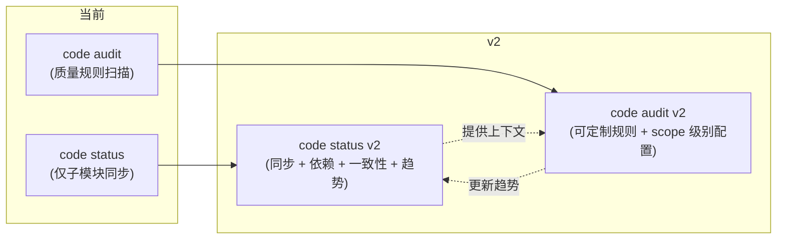

# `code status` v2 设计

> 基于架构师视角评估的 7 个缺口，重新设计 `qtcloud-devops code status` 命令。
> 当前 `code status` 只做子模块同步状态检查，v2 将其提升为"代码架构健康状态"视图。

---

## 一、设计原则

1. **Status ≠ Audit**: Status 是"当前快照"，只读、可离线、秒级返回。Audit 是"深度扫描"，可能运行外部工具、写文件、走网络。
2. **架构师的第一问**: `code status` 的回答应该是"代码架构当前健不健康"，而不是"子模块同步了没有"。
3. **渐进式揭示**: 默认输出一行总结，加 `-v` 展开细节，加 `--json` 供工具消费。

---

## 二、模型

```rust
pub struct CodeStatus {
    /// 子模块同步状态（现有逻辑）
    pub sync: SyncSection,

    /// 模块依赖结构（新）
    pub deps: DepSection,

    /// 跨 scope 一致性（新）
    pub consistency: ConsistencySection,

    /// 质量趋势摘要（新）
    pub health: HealthSection,
}

// ── 子模块同步 ──

pub struct SyncSection {
    pub components: Vec<ComponentStatus>,  // 现有
    pub total: usize,
    pub synced: usize,
    pub pending: usize,
}

// ── 模块依赖 ──

pub struct DepSection {
    pub modules: Vec<ModuleNode>,
    pub total_deps: usize,
    pub cycles: Vec<Cycle>,           // 循环依赖
    pub cross_scope_deps: Vec<CrossScopeDep>,  // 跨 scope 引用
}

pub struct ModuleNode {
    pub name: String,                  // scope 名或模块名
    pub kind: ModuleKind,              // Scope, ExternalCrate, InternalCrate
    pub depends_on: Vec<String>,       // 直接依赖
    pub depended_by: Vec<String>,      // 被谁依赖
}

pub enum ModuleKind {
    Scope,          // contract.yaml 定义的 scope
    InternalCrate,  // workspace crate
    ExternalCrate,  // 第三方依赖
}

pub struct Cycle {
    pub nodes: Vec<String>,
}

pub struct CrossScopeDep {
    pub from: String,  // 源 scope
    pub to: String,    // 目标 scope
    pub symbols: Vec<String>,  // 具体引用的符号
}

// ── 跨 scope 一致性 ──

pub struct ConsistencySection {
    pub rust_version: VersionConsistency,    // rust-version 一致性
    pub deps: DepConsistency,                // 公共依赖版本一致性
    pub lints: LintConsistency,              // lint 规则一致性
    pub ci_templates: CiConsistency,         // CI 模板一致性
}

pub enum VersionConsistency {
    Consistent(String),              // 统一版本
    Inconsistent(Vec<ScopeVersion>), // 各 scope 版本不同
    Missing,                         // 未声明
}

pub struct ScopeVersion {
    pub scope: String,
    pub value: String,
}

pub struct DepConsistency {
    pub total_shared: usize,            // 跨 scope 共用的依赖数
    pub drifted: Vec<DepDrift>,         // 版本漂移的依赖
}

pub struct DepDrift {
    pub name: String,
    pub versions: Vec<ScopeVersion>,
}

pub struct LintConsistency {
    pub uniform: bool,
    pub scope_lint_files: Vec<(String, Option<String>)>,  // scope → clippy.toml?
}

pub struct CiConsistency {
    pub workflow_names: Vec<String>,
    pub uniform: bool,
}

// ── 质量趋势 ──

pub struct HealthSection {
    pub last_audit: Option<AuditSnapshot>,
    pub trend: TrendDirection,
}

pub struct AuditSnapshot {
    pub timestamp: String,      // ISO 8601
    pub passed_rules: usize,
    pub total_rules: usize,
    pub findings: usize,
}

pub enum TrendDirection {
    Improving,
    Stable,
    Declining,
    Unknown,   // 只有一次记录或无记录
}
```

---

## 三、命令接口

```bash
# 基础用法（默认输出概要）
qtcloud-devops code status

# 完整信息（展开所有 section）
qtcloud-devops code status -v

# 仅查看依赖图
qtcloud-devops code status --section deps

# 仅查看一致性
qtcloud-devops code status --section consistency

# JSON 输出（供工具/Agent 消费）
qtcloud-devops code status --json
```

### 默认输出（概要）

```
代码架构状态
────────────────────────────────────────
  子模块:       ✅ 全部同步（12/12）
  模块依赖:     42 个内部依赖, 0 个循环
  跨 scope 一致性:
    Rust 版本:  ⚠ 不一致（cli: 1.75, web: 1.78）
    公共依赖:   ✅ 全部一致（23 个共享）
    CI 模板:    ✅ 统一
  质量趋势:     📈 改善中（最近审计: 7/9 通过, 较上次 +1）
```

### 详细输出（-v）

```
代码架构状态
────────────────────────────────────────

  📦 子模块同步
    ✅ 全部同步（12/12）

  🔗 模块依赖图
    ┌─ cli/ ─────────────────────────────┐
    │  → quanttide-devops (workspace)     │
    │  → gix, git2, serde, clap, ...      │
    │  ← (被依赖: plan/, release/)        │
    └─────────────────────────────────────┘
    ┌─ plan/ ─────────────────────────────┐
    │  → cli/ (quanttide-devops-cli)      │
    │  → source::roadmap                  │
    └─────────────────────────────────────┘
    内部依赖: 42 | 外部依赖: 186 | 循环: 0

  ⚖️ 跨 scope 一致性
    Rust 版本:
      ❌ cli:   edition 2021, rust-version 1.75
      ❌ web:   edition 2021, rust-version 1.78
      ❌ core:  edition 2021, rust-version 未设置
    公共依赖版本:
      ✅ serde:    1.0 (cli, web, core)
      ⚠  thiserror: 2.0 (cli) vs 1.0 (web)
    工作流:
      ✅ 全部 scope 共用 build-rust.yml

  📈 质量趋势
    上次审计: 2026-07-15T10:00:00Z
    7/9 规则通过 (较上次 +1)
    新发现: 2 | 已修复: 3 | 持续未修复: 5
    趋势: 📈 改善中
```

---

## 四、数据来源

| Section | 数据来源 | 速度 |
|---------|----------|------|
| **sync** | `source::git::submodule::scan_repo_state`（现有） | 秒级（offline 可加速） |
| **deps** | 解析 `Cargo.toml` workspace members + `[dependencies]`；按 scope 过滤；`cargo metadata --no-deps` 获取外部依赖树 | 秒级（`cargo metadata` 缓存友好） |
| **consistency** | 遍历各 scope 的 `Cargo.toml` 对比 `edition`/`rust-version`；对比 `[dependencies]` 中公共 crate 的版本；检查 `.github/workflows/*.yml` 引用 | 秒级（纯文件读取） |
| **health** | 读取 `data/history/` 下缓存的最近一次 audit 结果（JSON）；按时间戳排序取前 2 条计算趋势 | 毫秒级（本地 JSON 读取） |

### 离线优先级

| 场景 | 可用 section | 不可用 |
|------|-------------|--------|
| 完全离线 | sync, consistency, health | deps（需 `cargo metadata`） |
| 无历史记录 | sync, deps, consistency | health（无 baseline） |
| CI 环境 | sync, deps, consistency | health（无持久存储） |

---

## 五、与现有命令的关系



- `code status` 负责**全景视图**，回答"代码架构健康吗"
- `code audit` 负责**深度检查**，回答"哪里有问题需要修"
- `code status` 的 `health` section 的 baseline 由 `code audit` 运行结果写入

---

## 六、实现路径

### Phase 1: 模型与 CLI 接口
- 定义新的 `CodeStatus` 数据结构
- 扩展 `CodeAction::Status` 添加 `--section`、`-v`、`--json` 参数
- 保持现有 `SyncSection` 逻辑不变

### Phase 2: `deps` section
- 实现 `cargo metadata` 解析器（过滤 scope 内的 crate）
- 构建 `ModuleNode` 图（有向图，scope + internal crates）
- 检测循环依赖（DFS + 三色标记）
- 检测跨 scope 引用（from scope A → scope B 的 `use` 路径）

### Phase 3: `consistency` section
- 遍历 scope `Cargo.toml`，比较 `edition`/`rust-version`
- 公共依赖版本对比（取所有 scope 都引用的 crate，比较版本）
- CI 工作流引用一致性检查
- 可选: lint 配置一致性（`clippy.toml` / `.rustfmt.toml`）

### Phase 4: `health` section
- 定义 audit snapshot 存储格式（JSON 行文件，追加写入）
- `code audit` 完成时写入快照
- `code status` 读取最近两次快照计算趋势

---

## 七、未解决的开放问题

1. **跨语言依赖图**：当前只考虑 Rust（Cargo.toml），Python/Poetry 和 Go modules 的依赖如何纳入？
2. **`deps` section 的精度下限**：是只展示 scope 级别的粗粒度图，还是深入到每个 crate 的细粒度图？粗粒度速度快但信息量少，细粒度慢但能发现循环依赖。
3. **趋势持久化**：审计快照写到哪里？现有 `data/history/` 还是 `target/`（会被 clean 清理）？建议 `data/history/` 作为归档，`target/` 作为缓存。
4. **增量 vs 全量**：`deps` 和 `consistency` 能否增量计算？`cargo metadata` 本身有缓存，但 consistency 每次要读所有 `Cargo.toml`，文件数多时可能有 I/O 压力。
